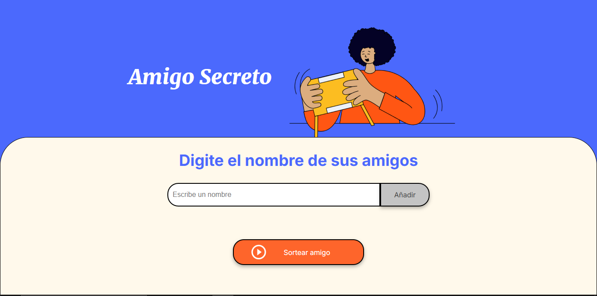
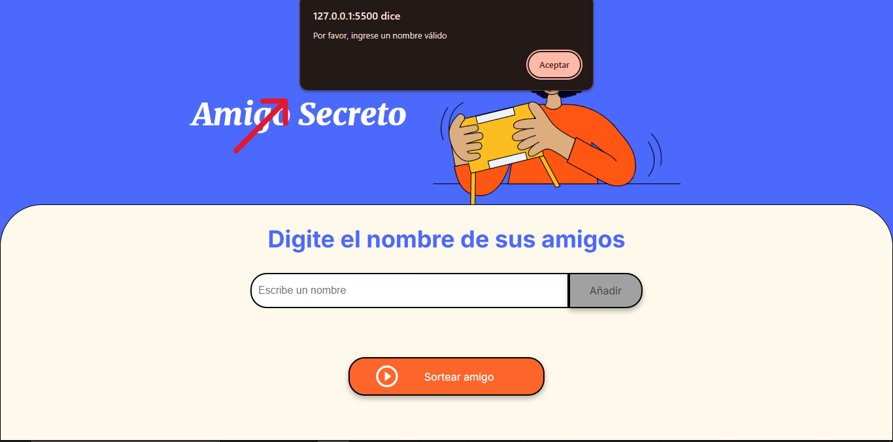
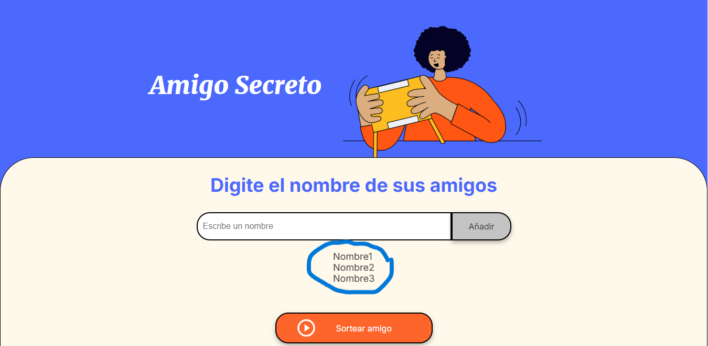

# Juego del Amigo Secreto 🎁

## Descripción del proyecto
El **Juego del Amigo Secreto** es una aplicación interactiva diseñada para realizar sorteos entre amigos. Los usuarios pueden agregar nombres a una lista y, con un clic, sortear de manera aleatoria quién será el "amigo secreto". Es ideal para organizar eventos divertidos y espontáneos entre amigos.

---

## ¿Cómo funciona?

1. **Agregar nombres**: Escribe un nombre en el campo de texto y haz clic en el botón `Adicionar`. 
   - Si el campo está vacío, el programa mostrará una alerta solicitando un nombre válido.

2. **Visualizar la lista**: Los nombres ingresados aparecerán en una lista visible justo debajo del campo de entrada.

3. **Sorteo aleatorio**: Al hacer clic en el botón `Sortear Amigo`, uno de los nombres se seleccionará aleatoriamente y se mostrará en la pantalla como el "amigo secreto".



---

## Explicación paso a paso 📜

1. **Inicio**:
   - Abre la aplicación.
   - Verás un campo de texto y un botón llamado `Adicionar`.


2. **Agregar nombres**:
   - Escribe el nombre de un amigo en el campo de texto.
   - Presiona el botón `Adicionar`.
   - Repite este paso para agregar tantos nombres como desees.

3. **Validar entradas**:
   - Si intentas agregar un nombre vacío, aparecerá una alerta indicando que necesitas ingresar un nombre válido.
   

4. **Lista de nombres**:
   - A medida que agregas nombres, aparecerán en una lista visible en la página, organizada automáticamente.
   

5. **Sorteo**:
   - Haz clic en el botón `Sortear Amigo`.
   - Un algoritmo seleccionará aleatoriamente un nombre de la lista.
   - El nombre del "amigo secreto" se mostrará en pantalla.
   

---

## Tecnologías utilizadas 🛠️
- **HTML5**: Para la estructura de la página.
- **CSS3**: Para los estilos y diseño visual.
- **JavaScript**: Para la lógica del programa y las interacciones dinámicas.

---

## Instalación y uso 🚀

1. Clona este repositorio:
   ```bash
   git clone https://github.com/tuusuario/amigo-secreto.git

2. Abre el archivo `index.html`  en tu navegador.

3.¡Empieza a jugar!🥳

---
## Otra forma de su uso
¡Puedes tambien entrar directamente la pagina si no quieres clonar el proyecto! aqui 👀:<a href=""></a>
---
## Reconocimientos 🌟
Este proyecto fue realizado con el apoyo de <a href ="https://www.aluracursos.com/">Alura Latam</a>, una plataforma dedicada al aprendizaje en tecnología y desarrollo de habilidades digitales. Gracias por la guía y recursos brindados. 🙌


## Autor
 
 Franco Freddi Veron
 Desarrollador/a entusiasta. Contacto: ffreddi07@gmail.com
